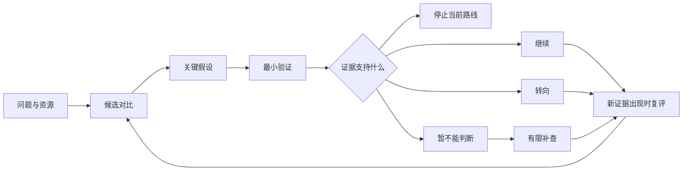

# 科研选题决策助手 · Research Topic Selector

**把“这个方向好像不错”，变成一份能和导师讨论的研究决策。**

一个中文优先的开源 AI Skill，帮助硕博生和研究人员比较方向、检查关键假设，并判断下一步该继续、转向，还是停止当前路线。适合开题、基金前期构思和项目复盘。

受 Michael A. Fischbach 在 *Cell*（2024）发表的选题文章启发，独立编写工作流、模板与示例。MIT 开源；没有脚本、API 密钥或额外服务依赖，运行需要支持 Skills 的 AI 工具，其使用费用由相应工具决定。

[下载 v0.1.0 安装包](https://github.com/wanmengjie/research-topic-selector/releases/tag/v0.1.0) · [查看 Skill](skills/research-topic-selector/SKILL.md) · [完整示例](skills/research-topic-selector/references/example.md) · [小红书文案](docs/xiaohongshu.md)

## 它会帮你产出什么

| 你现在的状态 | 得到的结果 |
| --- | --- |
| 有兴趣，但研究问题不清楚 | 有区别的候选问题，以及成功后可能改变什么 |
| 几个方向都想做 | 价值、可行性、资源与不确定性的并列比较 |
| 想法很大，不知道能不能做 | 关键假设清单，以及最早能改变决定的验证 |
| 已经做了一段时间，卡住了 | 保留核心目标、释放可变约束的备选路线 |
| 要与导师或合作者讨论 | 有依据、有条件、可复评的选题记录 |



它会明确区分“用户提供、已核查来源、推断、待核实”。没有依据的成功概率、新颖性和资源状态保留为未知。输出是一份决策辅助记录，发表结果与研究成效仍取决于真实证据和执行。

## 安装与开始

### 在 Codex 中安装

把下面这段话发给支持 skill-installer 的 Codex：

```text
请使用 $skill-installer，从 GitHub 仓库 wanmengjie/research-topic-selector
安装 skills/research-topic-selector 目录中的 skill。
```

也可下载 Release 中的 ZIP，将其中 `research-topic-selector` 文件夹放到当前工具的用户 Skills 目录。按当前 [OpenAI 官方文档](https://learn.chatgpt.com/docs/build-skills)，Codex 用户目录为 `~/.agents/skills/`，项目目录为 `.agents/skills/`；若你的既有安装使用不同目录，以工具实际配置为准。不要在多个扫描目录重复安装同名 skill。安装后未出现时，重启 Codex。

安装后的目录应类似：

```text
skills/
└── research-topic-selector/
    ├── SKILL.md
    ├── LICENSE
    ├── agents/openai.yaml
    └── references/
        ├── worksheet.md
        ├── example.md
        └── sources.md
```

本项目以可直接读取的 Skill 文件夹分发，尚未上架官方插件目录。其他支持 Agent Skills 的工具可按各自方式安装；其他客户端未在本次发布中逐一验证。普通聊天环境也可阅读 `SKILL.md` 作为提示词使用，但这不等同于安装和自动发现。

### 第一次使用

```text
请使用 $research-topic-selector 帮我比较以下选题。

我的阶段：硕士一年级，距离提交论文还有 9 个月。
研究领域：城市能源。
候选方向：A 温度与建筑用电的关联；B 室内热舒适；C 大模型预测用电。
已有资源：建筑月度用电和气象数据，Python 和基础回归技能。
限制：暂无新增传感器预算，数据权限还需要核实。
请给出候选比较、关键假设、最小验证，以及继续/转向/停止的条件。
先离线评估，新颖性保留为待核实。
```

只想快速判断，可以加一句“控制在一页”；要完整交付，可说“按工作表输出”。已经有明确题目时直接提交该题目，不必凑多个方向。

复盘时可以这样问：

```text
请使用 $research-topic-selector 复盘我的课题。
原问题是……原先固定的条件是……目前遇到的障碍是……
新证据是……剩余时间和资源是……
请区分技术失败、信息不足与核心假设受损，并提出下一次决策节点。
```

## 一个简短示例

> **当前建议：先验证 A 的数据是否适合问题。** A 已有数据可能带来更快反馈，但使用权限、数据质量和研究新意仍需核实。B 目前缺少设备；C 要先说明简单基线不能解决什么。若 A 的数据不支持问题，推荐需要调整。

接着得到假设表、最小验证和四类结果分支。[阅读完整虚构示例](skills/research-topic-selector/references/example.md)。示例没有实际运行研究，也不提供关于该领域新颖性的事实结论。

## 方法来源与设计说明

Fischbach, M. A. (2024). *Problem choice and decision trees in science and engineering*. Cell, 187(8), 1828–1833. [DOI](https://doi.org/10.1016/j.cell.2024.03.012) · [PubMed](https://pubmed.ncbi.nlm.nih.gov/38608651/)

本文启发了选题、假设审视和持续纠偏的总体思路。证据标签、四分支决策表、工作表与示例是本项目新增设计，详见 [来源说明](skills/research-topic-selector/references/sources.md)。其中“固定一个核心约束”不等同于“所有研究只能一次改变一个变量”。

本仓库没有收录论文全文、译文或原图。项目与原作者、斯坦福大学、Cell、Elsevier 或 OpenAI 无隶属或背书关系。原创内容采用 [MIT License](LICENSE)，第三方原文不在其许可范围内；见 [NOTICE](NOTICE.md)。

## 验证与贡献

v0.1.0 做了 Skill 结构校验、方法归属复核和一次独立离线行为试用，详见 [验证记录](docs/validation.md)。这不代表已证明能预测研究成功率，也不保证所有模型都严格遵循工作流。

欢迎提交 Issue 或 PR，附上脱敏后的输入、实际输出、问题所在和建议。请勿上传未授权数据或尚不打算公开的课题。改动方法时标明是对原论文的解释还是项目新增设计；可用仓库示例或验证记录中的案例检查改动。

## English overview

Research Topic Selector is a Chinese-first, instruction-only Agent Skill for choosing and reassessing research projects. It produces conditional comparisons, assumption audits, minimal validation plans, and Go/Pivot/Stop/Inconclusive decisions. It is inspired by Fischbach (2024), independently authored, and MIT licensed. It does not predict publication outcomes or claim institutional endorsement.
