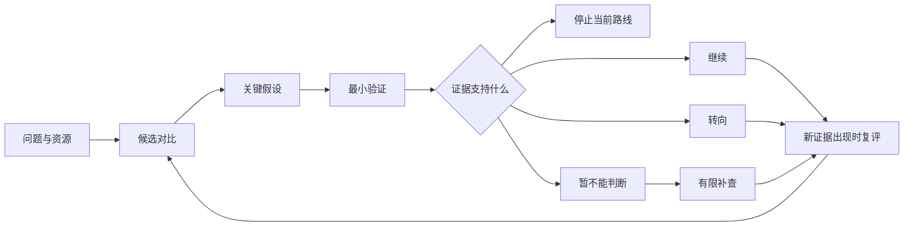

# 科研选题决策助手 · Research Topic Selector

**把“这个方向好像不错”，变成一份能和导师讨论的研究决策。**

一个中文优先、按 Agent Skills 格式组织的开源 AI Skill，面向 Codex、Claude Code、WorkBuddy 等宿主。帮助硕博生和研究人员比较方向、检查关键假设，并判断下一步该继续、转向，还是停止当前路线。适合开题、基金前期构思和项目复盘。

受 Michael A. Fischbach 在 *Cell*（2024）发表的选题文章启发，独立编写工作流、模板与示例。MIT 开源；v0.2.0 增加可选的 PubMed / OpenAlex 官方 API 检索脚本，只需 Python 3.10+，无第三方 Python 依赖。PubMed 基础查询无需密钥；OpenAlex 匿名搜索在本次测试时返回 503，详见下方限制说明。离线选题评估仍可直接使用工作流。运行需要支持 Skills 的 AI 工具，其使用费用由相应工具决定。

[下载 v0.3.0 跨平台安装包](https://github.com/qianqianwanwanmiumiu/research-topic-selector/releases/tag/v0.3.0) · [查看 Skill](skills/research-topic-selector/SKILL.md) · [完整示例](skills/research-topic-selector/references/example.md) · [验证范围](docs/validation.md)

v0.3.0 保持一份核心工作流与 Python 脚本，增加各宿主安装指引和 WorkBuddy 元数据适配包。支持标准格式不等于所有客户端、版本和操作系统均已实测；实际验证范围见下方说明。

## 它会帮你产出什么

| 你现在的状态 | 得到的结果 |
| --- | --- |
| 有兴趣，但研究问题不清楚 | 有区别的候选问题，以及成功后可能改变什么 |
| 几个方向都想做 | 价值、可行性、资源与不确定性的并列比较 |
| 想法很大，不知道能不能做 | 关键假设清单，以及最早能改变决定的验证 |
| 已经做了一段时间，卡住了 | 保留核心目标、释放可变约束的备选路线 |
| 要与导师或合作者讨论 | 有依据、有条件、可复评的选题记录 |



它会明确区分“用户提供、已核查来源、推断、待核实”。没有依据的成功概率、新颖性和资源状态保留为未知。输出是一份决策辅助记录，发表结果与研究成效仍取决于真实证据和执行。

## 安装与开始

### 选择安装包

从 Release 下载相应附件，不要把整个仓库的 Source code ZIP 当成单个技能包：

| 安装包 | 用途 |
| --- | --- |
| `research-topic-selector-v0.3.0.zip` | Codex、Claude Code 及其他兼容 Agent Skills 的工具；解压后安装整个 `research-topic-selector` 文件夹 |
| `research-topic-selector-v0.3.0-workbuddy.zip` | WorkBuddy 导入包；增加其官方字段表中的双语描述、作者和顶层版本字段，移除 Codex 可选 UI 文件；工作流正文和检索代码与通用包相同 |
| `research-topic-selector-v0.3.0.sha256` | 上述两个 ZIP 的 SHA-256 校验值 |

### 各工具的安装与调用

| 工具 | 安装位置或方式 | 调用示例 |
| --- | --- | --- |
| Codex | 将通用包文件夹放入 `~/.agents/skills/` 或项目 `.agents/skills/`；既有环境可能配置了其他目录，以实际设置为准 | `$research-topic-selector 帮我比较以下选题……` |
| Claude Code（CC） | 将通用包文件夹放入 `~/.claude/skills/` 或项目 `.claude/skills/` | `/research-topic-selector 帮我比较以下选题……` |
| WorkBuddy | 下载 WorkBuddy 包，在“技能 → 添加技能 → 上传技能”中选择 ZIP | 启用后用自然语言：`请使用 research-topic-selector 帮我比较以下选题……` |
| 其他 Agent Skills 宿主 | 按该工具的官方方式安装通用包文件夹，并确认能读取附带资源 | 使用该工具的技能选择入口，或按名称提出请求；不要假定它支持 `$` 或 `/` 前缀 |

`~` 表示使用者的主目录，项目路径相对于项目根目录。不要在同一宿主多个扫描目录重复安装同名技能；安装后按该工具要求刷新或重启。Windows、macOS、Linux 共用同一份 Python 源码，但解释器命令和运行权限由所在环境决定。

这些安装入口依据 [Codex 官方说明](https://learn.chatgpt.com/docs/build-skills)、[Claude Code 官方说明](https://code.claude.com/docs/en/skills) 和 [WorkBuddy 官方安装说明](https://www.workbuddy.cn/docs/workbuddy/From-Beginner-to-Expert-Guide/Function-Description/Skills-Market)。WorkBuddy 包按其 [开放平台字段与目录说明](https://open.workbuddy.cn/docs/skill) 适配：该字段表不等同于已经验证每个版本的本地导入器；ZIP 沿用官方目录示例中的单个技能文件夹，尚未在 WorkBuddy 客户端实机导入。

Codex 用户也可让已安装的 skill-installer 从仓库 `qianqianwanwanmiumiu/research-topic-selector` 的 `skills/research-topic-selector` 目录安装；其他工具无需依赖这个安装器。

安装后的目录应类似：

```text
skills/
└── research-topic-selector/
    ├── SKILL.md
    ├── LICENSE
    ├── agents/openai.yaml       # 仅通用包保留的 Codex 可选 UI 元数据
    ├── scripts/search_literature.py
    └── references/
        ├── database-search.md
        ├── worksheet.md
        ├── example.md
        └── sources.md
```

本项目以 Skill 文件夹分发，尚未上架各平台官方市场。核心内容不调用 Codex CLI、OpenAI API 或专属 MCP。只有离线分析时，无需 Python；直接数据库检索需要执行环境提供 Python 3.10+、网络和任务目录写权限。仅支持普通聊天、无法读取文件或执行脚本的环境可以使用文本版指引，但不具备自动加载附带资源或运行检索脚本的完整能力。

### 数据库检索（v0.2.0）

核查已有研究时，可以直接查询 PubMed 与 OpenAlex，获取标题、作者、DOI/PMID、可用摘要，并保存检索式、时间、总命中数、实际获取数和错误/截断状态。两库检索结果按 DOI/PMID 合并来源。用法、可选环境变量与官方接口说明见 [数据库检索说明](skills/research-topic-selector/references/database-search.md)。Web Search 仍可用于补充官方数据与其他资料。

验证限制：PubMed 已通过真实联网测试；2026-09-30 测试时 OpenAlex 官方临时暂停匿名搜索并返回 503，其成功搜索路径目前仅通过离线模拟测试。使用者可等待匿名服务恢复或配置自己的 `OPENALEX_API_KEY` 后重新验证。真实 API 失败会保留其他库的结果并明确记录错误，不会当成零命中。

### 第一次使用

```text
请使用 research-topic-selector 帮我比较以下选题。

我的阶段：硕士一年级，距离提交论文还有 9 个月。
研究领域：城市能源。
候选方向：A 温度与建筑用电的关联；B 室内热舒适；C 大模型预测用电。
已有资源：建筑月度用电和气象数据，Python 和基础回归技能。
限制：暂无新增传感器预算，数据权限还需要核实。
请给出候选比较、关键假设、最小验证，以及继续/转向/停止的条件。
先离线评估，新颖性保留为待核实。
```

只想快速判断，可以加一句“控制在一页”；要完整交付，可说“按工作表输出”。已经有明确题目时直接提交该题目，不必凑多个方向。

复盘时可以这样问：

```text
请使用 research-topic-selector 复盘我的课题。
原问题是……原先固定的条件是……目前遇到的障碍是……
新证据是……剩余时间和资源是……
请区分技术失败、信息不足与核心假设受损，并提出下一次决策节点。
```

## 一个简短示例

> **当前建议：先验证 A 的数据是否适合问题。** A 已有数据可能带来更快反馈，但使用权限、数据质量和研究新意仍需核实。B 目前缺少设备；C 要先说明简单基线不能解决什么。若 A 的数据不支持问题，推荐需要调整。

接着得到假设表、最小验证和四类结果分支。[阅读完整虚构示例](skills/research-topic-selector/references/example.md)。示例没有实际运行研究，也不提供关于该领域新颖性的事实结论。

## 方法来源与设计说明

Fischbach, M. A. (2024). *Problem choice and decision trees in science and engineering*. Cell, 187(8), 1828–1833. [DOI](https://doi.org/10.1016/j.cell.2024.03.012) · [PubMed](https://pubmed.ncbi.nlm.nih.gov/38608651/)

本文启发了选题、假设审视和持续纠偏的总体思路。证据标签、四分支决策表、工作表与示例是本项目新增设计，详见 [来源说明](skills/research-topic-selector/references/sources.md)。其中“固定一个核心约束”不等同于“所有研究只能一次改变一个变量”。

本仓库没有收录论文全文、译文或原图。项目与原作者、斯坦福大学、Cell、Elsevier 或 OpenAI 无隶属或背书关系。原创内容采用 [MIT License](LICENSE)，第三方原文不在其许可范围内；见 [NOTICE](NOTICE.md)。

## 验证与贡献

已验证 Python 检索脚本、Skill 结构及发布包；各客户端的格式核对与实机验证情况分别记录在 [验证记录](docs/validation.md)，不把静态检查当作所有平台的端到端运行证明。既有版本的联网核查和行为试用记录也予以保留。这不代表已证明能预测研究成功率，也不保证所有模型都严格遵循工作流。

维护者可运行 `python scripts/build_release.py` 生成两个发行包与校验文件；构建过程检查共同文件和工作流正文的一致性，并拒绝覆盖已有发行文件。

欢迎提交 Issue 或 PR，附上脱敏后的输入、实际输出、问题所在和建议。请勿上传未授权数据或尚不打算公开的课题。改动方法时标明是对原论文的解释还是项目新增设计；可用仓库示例或验证记录中的案例检查改动。

## English overview

Research Topic Selector is a Chinese-first Agent Skill for choosing and reassessing research projects. Its host-independent workflow and standard-library Python search helper can be used by compatible agents with the required capabilities. Releases include a standard package for Codex, Claude Code and other Agent Skills hosts, plus a WorkBuddy metadata variant. Client-specific runtime verification is documented separately. It is inspired by Fischbach (2024), independently authored, and MIT licensed; it does not predict publication outcomes or claim institutional endorsement.
